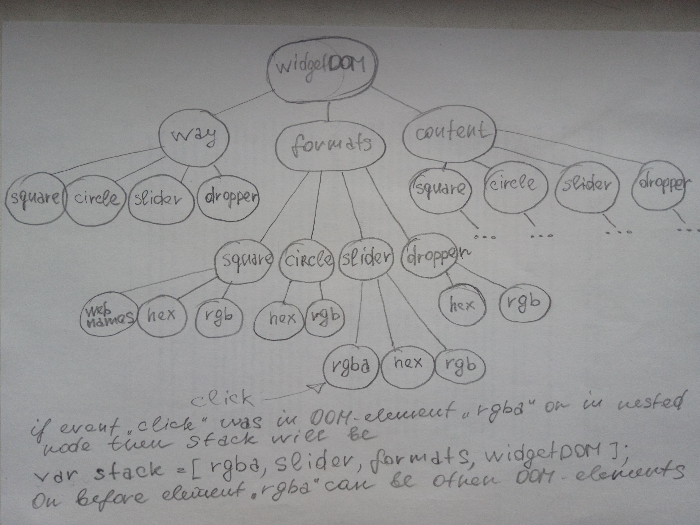

JS. Виджет "Colorpicker"
========================

Как использовать в проекте виджет colorpicker?
----------------------------------------------
### Подключение к странице
Для подключения виджета необходимо подключить два файла: 
1. colorpicker.js
2. colorpicker.css

```html
<!DOCTYPE html>
<html>
    <head>
        <title>colorpicker</title>
        <meta charset="utf-8">
        <link rel="stylesheet" href="colorpicker.css" />
    </head>
    <body>
        <h1>Colorpicker</h1>
        <input id="addd" class="super" />
        <input class="super" />
        <input class="super" />
        <!-- Не забывайте, что виджет нужно вызвать после того, как построен DOM -->
        <script src="colorpicker.js"></script>
        <script>
            colorPicker(".super");
        </script>
    </body>
</html>
```

### Инициализация виджета
После того, как построен DOM документа, можно вызывать виджет. Виджету необходимо передать параметры. 
Параметры можно передать: 1) в виде строки и 2) в виде объекта.
**Внимание!** Вы можете подключить виджет не к одному, а сразу к нескольким input. Желательно подключать виджет 
именно к input, так как выбранные значения присваиваются свойству value, DOM-элемента. Поэтому, если вы 
решите подключить виджет к div, то у самого DOM-элемента не будет такого свойства, вы конечно его создадите,
но на экране вы ничего не увидите, так как для отображения в DIV, вам необходимо изменять свойство textContent.

#### 1. Параметр в виде строки
**colorPicker(".css-class-of-input-where-you-want-to-add-colorpicker");**

Думается - всё очевидно. Вы указывается класс тех или того input, к которым вы хотите прикрепить виджет.
Вместо класса можно указать id, или любой другой css-селектор. Работает по принципу jQuery. 

#### 2. Параметры перечисленные в виде свойств в объекте.
#### Какие параметры необходимо указать в объекте? 
Имя свойства | Является обязательным | Тип данных свойства | Описание
-------------|-----------------------|---------------------|----------------------
selector | Да | string | CSS-селектор, как и в случае со строкой в пункте 1.
lang | Нет | string | Этот функционал надо реализовывать. Влияет на отображение названий вкладок. По умолчанию ru.
startWayName | Нет | string | Вкладка, открываемая по умолчанию. То есть способ, которым вы хотите выбирать цвет. Возможные значения: square, slider. По умолчанию square.
startColorFormat | Нет | string | Формат представления значения цвета. То есть открыв вкладку сразу будет выбран заданный этим параметром формат. Возможные значения: rgb, hex, webnames. По умолчанию hex. Webnames - это html-названия цветов.

#### Пример
1. **colorPicker({selector: "input.colorpicker", startColorFormat: "rgb"});**
2. **colorPicker({selector: "input.colorpicker"});**

### CSS
Чтобы настроить свои стили, в данный момент реализована лишь возможность изменения имеющихся стилей,
которые представлены в файле colorpicker.css.

Доработка виджета, если интересно
----------------------------------------------
Скажу честно, я заебался работать над таким, казалось бы простым компонентом. Можете сами увидеть дату первого 
коммита 16 июля 2109 года (коммит: 5a3ecc6ebdae01c5b1f83446979b55e78568866a). А когда я пишу этот текст уже 
17 августа 2019 года. И тут вдруг я понял важность проектов open source. Теперь я просто стал их любить.

#### Что, по-моему мнению нужно доработать? 
Дохрена всего. 
1. 

Описание для разработчиков
----------------------------------------------

### Структуры данных виджета

    wayOfGettingColorMap
    colorFormatsMap
    matchFormatToMethodMap
    cssClassesMap
    colorNamesMap

### Функции виджета

    colorPicker - возвращаемая функция из модуля (IIFE)
    copyObject
    getInputSizeAndPosition
    createWidgetDOMElement
    buildSquare
    buildSlider
    createResult
    createSlide
    createInput
    restructurize
    bindEventListeners

### Структуры данных функции colorPicker

    inputStackDOMList
    commonParamsMap
    paramsOfcreateWidgetDOMElement
    paramsOfBindEventListeners

### Структуры данных функции bindEventListeners

    rgbMap
    oneWayDifferrentAreasList
    colorFormatsKeysList
    colorNamesList
    squareDOMList
    sliderDOMList
    waysDOMList
    formatsDOMList
    formatsDOMByWayList
    contentsDOMList
    contentAreaEventsHandlesFnList
    rgbInputsList
    slidersList
    webnamesDOMList

### Функции определенные внутри bindEventListeners

    getDOM
    getElemsByWay
    getElemsByColorFormat
    matchElements
    clickInput
    handleAllWidgetEvents
    switchWay
    chooseFormat
    getValue
    mousedown
    mouseup
    mousemove
    click
    handleClickOnContentSquare
    handleClickOnContentSlider
    clickClose
    createOutputValueString
    clickOutOfWidget
    convertDecToHEX
    convertHexToDEC
    initRGB
    setWebnameFocus
    setValueSliderInput
    setSlidersPosition
    setRGBThroughSlidersPosition
    setSliderResultValue
    getKeyByName
    saveRGB
    hideWidget
    endupChoice
    displayWidget
    applyDefaultValues
    goThroughDOMNodesUp
    setWebnameFocus
    getColorFormatKeyByCssClass
    
    
### Идея заложенная в обработку событий клика в разных областях виджета colorpicker


Полное описание процесса будет представлено примерно в первой декаде августа 2019г.
