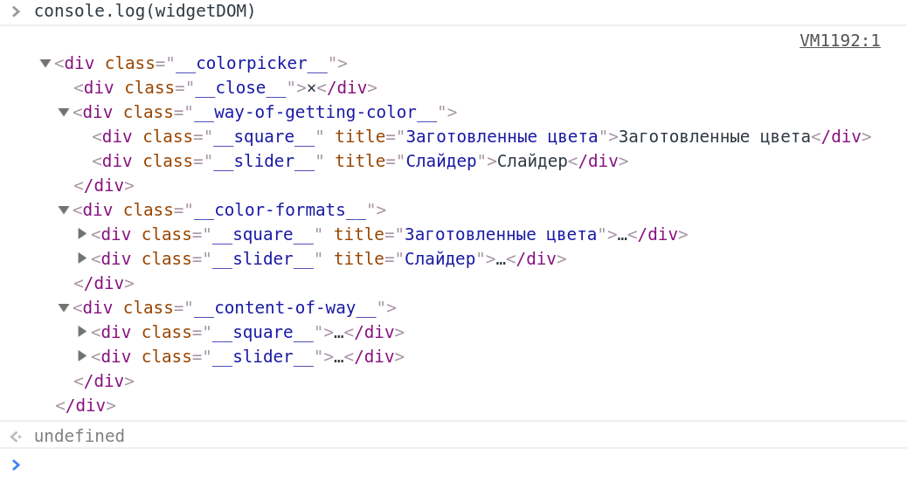

JS. Виджет "Colorpicker"
========================

Как использовать в проекте виджет colorpicker?
----------------------------------------------
### Подключение к странице
Для подключения виджета необходимо подключить два файла: 
1. colorpicker.js
2. colorpicker.css

```html
<!DOCTYPE html>
<html>
    <head>
        <title>colorpicker</title>
        <meta charset="utf-8">
        <link rel="stylesheet" href="colorpicker.css" />
    </head>
    <body>
        <h1>Colorpicker</h1>
        <input id="addd" class="super" />
        <input class="super" />
        <input class="super" />
        <script src="colorpicker.js"></script>
        <script>
            colorPicker({selector: ".super", startColorFormat: "rgb", startWayName: "square", lang: "en"});
        </script>
    </body>
</html>
```

### Инициализация виджета
После того, как построен DOM документа, можно вызывать виджет. Виджету необходимо передать параметры. 
Параметры можно передать: 1) в виде строки и 2) в виде объекта.
**Внимание!** Вы можете подключить виджет не к одному, а сразу к нескольким input. Нужно подключать виджет 
именно к input, так как выбранные пользователем значения присваиваются свойству value DOM-элемента. Поэтому, если вы 
решите подключить виджет к div, то у самого DOM-элемента не будет такого свойства, своим выбором вы конечно его создадите,
но на экране вы ничего не увидите, так как для отображения в DIV, вам необходимо изменять свойство textContent.

#### 1. Параметр в виде строки
**colorPicker(".css-class-of-input-where-you-want-to-add-colorpicker");**

Думается - всё очевидно. Вы указывается класс тех или того input, к которым вы хотите прикрепить виджет.
Вместо класса можно указать id, или любой другой css-селектор. Работает по принципу jQuery. 

#### 2. Параметры перечисленные в виде свойств в объекте.
#### Какие параметры необходимо указать в объекте? 
Имя свойства | Является обязательным | Тип данных свойства | Описание
-------------|-----------------------|---------------------|----------------------
selector | Да | string | CSS-селектор, как и в случае со строкой в пункте 1.
lang | Нет | string | Влияет на отображение названий вкладок. По умолчанию ru. Возможные значения: **ru, en**.
startWayName | Нет | string | Вкладка, открываемая по умолчанию. То есть способ, которым вы хотите выбирать цвет. Возможные значения: **square, slider**. По умолчанию square.
startColorFormat | Нет | string | Формат представления значения цвета. То есть открыв вкладку сразу будет выбран заданный этим параметром формат. Возможные значения: **rgb, hex, webnames**. По умолчанию hex. Webnames - это html-названия цветов.

#### Пример
1. **colorPicker({selector: "input.colorpicker", startColorFormat: "rgb"});**
2. **colorPicker({selector: "input.colorpicker"});**

### CSS
Чтобы настроить свои стили, в данный момент реализована лишь возможность изменения имеющихся стилей,
которые представлены в файле colorpicker.css.

Доработка виджета, если интересно
----------------------------------------------
Скажу честно, я упарился работать над таким, казалось бы простым компонентом. Можете сами увидеть дату первого 
коммита 16 июля 2109 года (коммит: 5a3ecc6ebdae01c5b1f83446979b55e78568866a). А когда я пишу этот текст уже 
17 августа 2019 года. И тут вдруг я понял важность проектов open source. Теперь я просто стал их любить.

#### Что нужно доработать (баги, фичи)?

1. **feature**. Перевести разработку виджета на модульную разработку с применением сборщика. Делая по старинке, в результате появляется сложность восприятия и необходимость постоянно мотать туда сюда текст. Также приходится считаться с синтаксисом для браузеров типа IE9 и вместо JS6, использовать синтаксис JS5.1. 
2. **bug**. Сделать инициализацию свойства background элемента с классом "__slider-result__". При установке параметра startWayName в slider, элемент имеет белый фон. 
3. **bug**. Если во вкладке "Заготовленные цвета" выбрать цвет, затем вновь открыть виджет и перейти в "Слайдер", то при изменении позиции ползунков в результате изменяется цвет и если переключиться вновь на "Заготовленные цвета", то на этой вкладке будет по-прежнему отображаться предыдущий выбор, сделанный на этой вкладке. 
4. **feature**. Сделать дополнительный формат цвета - rgba. Я изначально делал с ним, но это усложняло работу из-за отсутствия модульности. Плюс приходилось учитывать больше параметров, а архитектура не была проработана должным образом. 
5. **feature**. Сделать дополнительный способ выбора цвета - прямоугольник с градиентом и ползунком для выбора тона, а сам цвет выбирается пипеткой внутри прямоугольника. 
6. **feature**. Вместо слов - svg-изображения.
7. **feature**. Добавить несколько цветов в "Заготовленные цвета": чёрный и несколько серых. 
8. **feature**. Добавить возможность пользовательской настройки css. То есть передачу классов через параметр. Он добавляет классы в объект с параметрами, указывая для какого раздела виджета этот класс. Конечно он должен позаботиться о реализации самого css-класса. 
Например: **{ selector: ".colorpicker", css: { way: ["abc", "def"], format: ["ghi"], content: ["klm"] } }**
9. **feature**. Если уже сделан выбор цвета, например в формате hex, то при переключении формат, скажем на rgb, автоматически в поле input, изменять значение.
10. **bug**. При установке в параметре startColorFormat значения webnames, а startWayName значения slider, то при открытии виджета формат остаётся на вкладке slider не выбранным. Это надо исправить.
11. **bug**. В IE при передвижении ползунка на вкладке "Слайдер", если ранее не выбирался никакой цвет, в полях с числовыми значениями у тех каналов, ползунки которых не передвигаются, отображается NaN вместо 0 (ноль).


Описание для разработчиков
----------------------------------------------
### DOM-структура виджета


На изображении есть 3 главных DOM-узла: 

1. div.__way-of-getting-color__
2. div.__color-format__
3. div.__content-of-way__

Внутри каждой главной области расположены дочерние области:

1. div.__square__
2. div.__slider__

На следующем изображении представлена эта древовидная структура. Имена написаны условно. На изображении представлено больше узлов со способом выбора цвета. Это был изначальный план. Впоследствии, столкнувшись со сложностью, я решил упростить и свёл всего к двум способам. 


Управление виджетом производится при помощи классов. 

Вы можете менять структуру дерева: добавлять дополнительные узлы между узлами по вертикали. Вы можете добавить листья. Вы можете добавлять классы к имеющимся классам в имеющихся узлах. Но нельзя перемещать элементы из одной главной области в другую. Нельзя переименовывать установленные классы для управления. 

Далее приводятся структуры данных виджета. Если вы рассмотрите структуру cssClassesMap, то увидите, что есть классы для управления, построения,  стилизации и работы с содержимым.

Главное преимущество реализованное в виджете. Виджет инициализируется один раз, при загрузке страницы и инициализирует все необходимые в дальнейшем структуры данных, содержимое которых DOM-элементы. В дальнейшем, когда пользователь взаимодействует с виджетом, вычислений вроде того, какой класс содержал целевой элемент - не производится. После инициализации уже есть все необходимые структуры данных. При взаимодействии пользователя с виджетом все DOM-узлы, от того узла дерева (включая его), на котором произошло событие вплоть до узла с классом "__colorpicker__", помещаются в стэк. Затем производится работа с этим стеком.

### Обработка событий

Виджетом обработаюыватся события: 1) click, 2) mousedown, 3) mousemove, 4) mouseup. Все события обрабатываются функцией handleAllWidgetEvents, которая далее вызывает другие функции в зависимости от того, в какой области произошло событие. Областью считается одна из главных областей, как было показано ранее на изображении.  

#### Событие click

Когда в виджете происходит это событие, сначала, на основе стэка, выясняется в какой области произошёл клик. Допустим это область "div.__way-of-getting-color__". Значит затем будет вызвана функция switchWay и ей будет передан стэк. Эта функция уберёт или добавить css-классы (border, hide) DOM-элементам. 

### Структуры данных виджета

    wayOfGettingColorMap
    colorFormatsMap
    sliderResultTextsMap
    matchFormatToMethodMap
    cssClassesMap
    colorNamesMap

### Функции виджета

    colorPicker - возвращаемая функция из модуля (IIFE), читай класс
    copyObject
    getInputSizeAndPosition
    createWidgetDOMElement
    buildSquare
    buildSlider
    createResult
    createSlide
    createInput
    restructurize
    bindEventListeners

### Структуры данных функции colorPicker

    inputStackDOMList
    commonParamsMap
    paramsOfcreateWidgetDOMElement
    paramsOfBindEventListeners

### Структуры данных функции bindEventListeners

    rgbMap
    oneWayDifferrentAreasList
    colorFormatsKeysList
    colorNamesList
    squareDOMList
    sliderDOMList
    waysDOMList
    formatsDOMList
    formatsDOMByWayList
    contentsDOMList
    contentAreaEventsHandlesFnList
    rgbInputsList
    slidersList
    confirmButtonsList
    webnamesDOMList

### Функции определенные внутри bindEventListeners

    getDOM
    getElemsByWay
    getElemsByColorFormat
    matchElements
    clickInput
    handleAllWidgetEvents
    switchWay
    chooseFormat
    getValue
    mousedown
    mouseup
    mousemove
    click
    handleClickOnContentSquare
    handleClickOnContentSlider
    clickClose
    createOutputValueString
    clickOutOfWidget
    convertDecToHEX
    convertHexToDEC
    initRGB
    setWebnameFocus
    setValueSliderInput
    setSlidersPosition
    setRGBThroughSlidersPosition
    setSliderResultValue
    getKeyByName
    saveRGB
    hideWidget
    endupChoice
    displayWidget
    applyDefaultValues
    goThroughDOMNodesUp
    setWebnameFocus
    getColorFormatKeyByCssClass